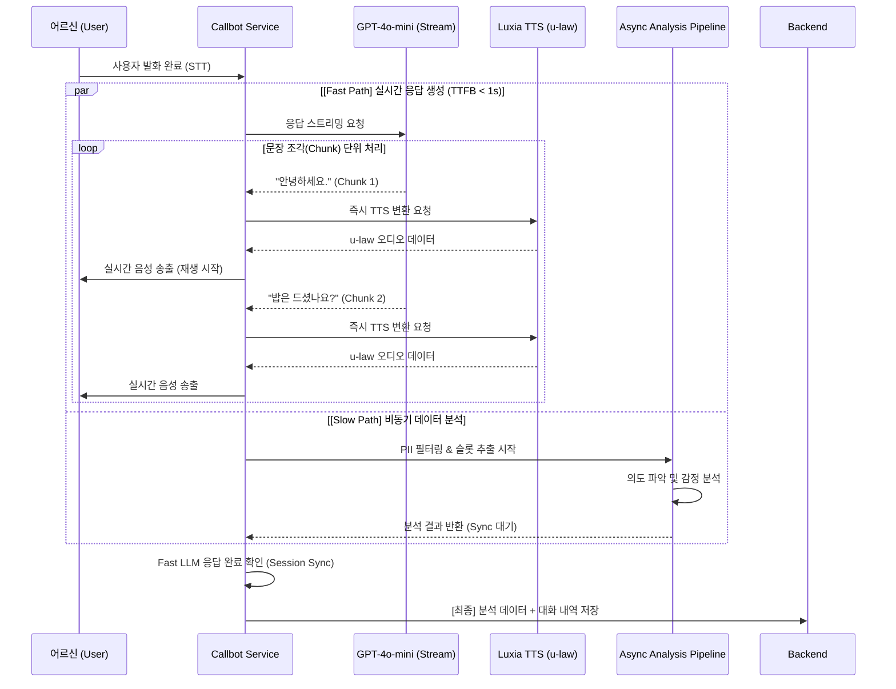
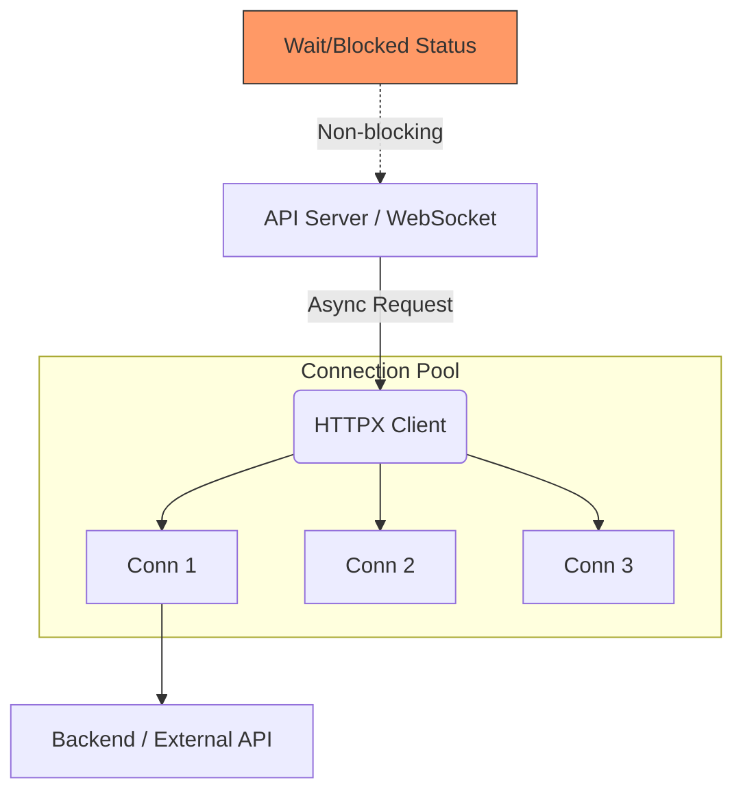
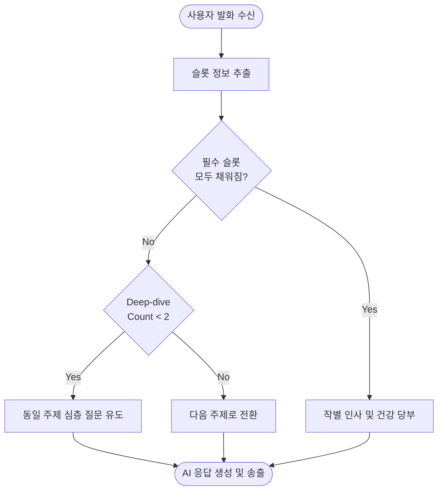
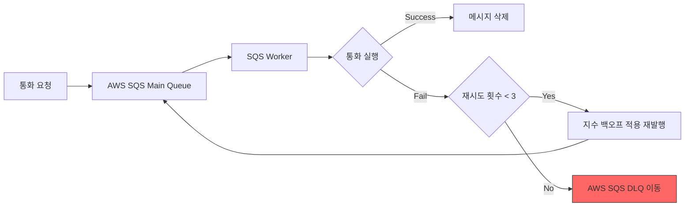
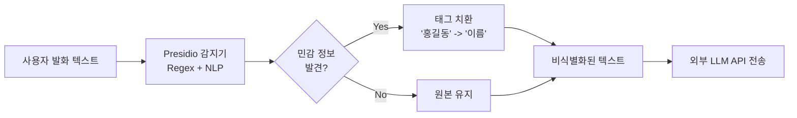

# 기술적 문제 해결 (Technical Resolutions)

  

## 1. TTS 스트리밍 및 백그라운드 분석 도입을 통한 응답 지연 시간 60% 단축 (5s → 2s)

- **문제 원인 (Bottleneck)**
  - **직렬 처리 구조의 한계**: `[문장 생성] → [음성 변환(TTS)] → [재생]`의 순차적 동작으로 인해 문장이 길어질수록 어르신이 체감하는 대기 시간이 **평균 5초 이상** 발생
  - **분석 오버헤드**: 개인정보 필터링(PII), 의도 파악, 슬롯 추출 등의 분석 작업이 답변 생성 전에 수행되어 지연 가중

- **해결 과정 (Optimization Strategy)**
  - **문장 단위 TTS 스트리밍 (Chunked Streaming)**: LLM의 출력을 실시간 모니터링하여 마침표(`.`)나 줄바꿈(`\n`) 등 구분자가 나타나는 즉시 TTS 엔진으로 전송. 전체 답변 완성을 기다리지 않고 첫 문장 조각이 생성되는 즉시 음성을 송출하여 첫 마디가 나오는 시점(TTFB)을 1초 미만으로 단축
  - **비동기 백그라운드 분석 (Background Tasking)**: 답변 생성과 직접적 연관이 없는 분석 작업들을 `asyncio` 태스크로 분리하여 답변 생성과 병렬로 실행
  - **u-law 오디오 캐싱**: 자주 사용되는 안내 멘트는 미리 u-law 포맷으로 변환하여 캐싱함으로써 TTS 엔진 호출 비용을 제거

- **결과 (Measured Performance)**
  - 기존 평균 5.2초였던 응답 대기 시간을 **최대 2.1초대(평균 1.8초)**로 줄여 약 **60% 이상의 성능 향상** 달성
  - 자연스러운 대화 리듬 확보를 통해 어르신의 대화 이탈률 감소 및 UX 만족도 증대

  

## 2. HTTPX 기반 비동기 통신 아키텍처 구축을 통한 백엔드 연동 효율화

- **문제 원인**
  - **Blocking I/O 문제**: 기존 `requests` 라이브러리 사용 시 HTTP 요청 중 스레드가 점유되어, 실시간 스트리밍 대화 중 시스템이 멈추거나 응답이 끊기는 현상 발생
  - **Connection 관리 부재**: 백엔드(Spring Boot)와의 빈번한 통신 시 매번 새로운 연결을 생성하여 오버헤드 발생

- **해결 과정**
  - **Async HTTPX Client 도입**: 프로젝트 전반(`http_client.py`, `websoket_twilio.py`, `luxia_client.py` 등)에 비동기 비차단(Non-blocking) 라이브러리인 `httpx`를 전면 도입
  - **Connection Pooling**: `AsyncClient`를 싱글톤 또는 세션 단위로 관리하여 TCP 연결 재사용 및 핸드셰이크 오버헤드 최소화
  - **고급 에러 핸들링**: `httpx.HTTPStatusError` 및 `RequestError`를 세분화하여 처리하고, 401 Unauthorized 발생 시 자동으로 재로그인하여 토큰을 갱신하는 리트라이 로직 구현

- **결과**
  - 실시간 음성 스트리밍과 백엔드 데이터 동기화 작업을 동시에 수행해도 성능 저하 없는 안정적인 환경 구축
  - 외부 API 호출 지연 시에도 전체 시스템의 동시성(Concurrency)을 유지하여 안정적인 서비스 제공

  

## 3. Deep-Dive 구조 설계를 통한 심층 안부 확인 및 대화 연속성 강화

- **문제 원인**
  - **단발성 질의응답**: 사용자의 단답형 답변에 대해 즉시 다음 주제로 넘어가면 대화가 기계적이고 차갑게 느껴지는 문제 발생
  - **정보 부족**: "아파"라는 짧은 대답만으로 슬롯을 채울 경우, 구체적인 증상이나 상황을 파악하기 어려워 돌봄 데이터로서의 가치 하락

- **해결 과정**
  - **Deep-Dive 카운트 로직**: `deep_dive_count` 변수를 통해 특정 주제(슬롯)에 대한 대화 턴 수를 추적(기본 2회 설정)
  - **조건부 주제 전환**: 슬롯이 채워지지 않았거나, 채워졌더라도 딥다이브 횟수(`MAX_DEEP_DIVE_TURNS = 2`)에 도달하지 않은 경우 동일 주제에 대한 심층 질문(Follow-up Question)을 우선 생성
  - **Contextual Empathy**: 이전 턴의 사용자 발화 내용을 기억하여 "허리가 아프시다고 하셨는데, 병원은 다녀오셨나요?"와 같은 맥락 기반 공감 반응 유도

- **결과**
  - 어르신 한 명당 평균 대화 지속 시간 증가 및 보다 구체적인 건강/생활 정보 수집 성공
  - 기계적인 문답이 아닌 진심 어린 안부를 묻는 '인간 중심 AI' 서비스 가치 구현

  

## 4. AWS SQS 및 DLQ를 활용한 비동기 통화 요청의 신뢰성 확보 및 결함 허용(Fault Tolerance) 설계

- **문제 원인**
  - **메시지 유실 및 병목 현상**: 대량의 안부 전화 예약 건 발생 시 서버가 모든 요청을 즉시 처리하려 하면 리소스 부족으로 시스템이 다운되거나 일부 요청이 유실될 위험이 있음
  - **외부 API 장애 취약성**: Twilio 등 외부 통신 API 서비스의 일시적 장애 발생 시, 자동 재시도 로직 없이는 서비스의 연속성을 보장하기 어려움

- **해결 과정**
  - **SQS 기반 비동기 워커 구조**: API 서버가 요청을 받으면 즉시 SQS 큐에 메시지를 발행하고 응답을 반환(Fire-and-forget). 실제 통화 실행은 독립적인 `SQSWorker`가 큐를 폴링하여 처리하는 이벤트 기반 아키텍처 구축
  - **지수 백오프(Exponential Backoff) 재시도**: 실패한 통화 요청에 대해 `retry_count`를 추적하며 30초, 60초, 90초와 같이 점진적으로 증가하는 지연 시간을 적용해 큐에 재발행
  - **DLQ(Dead Letter Queue) 연동**: 최대 재시도 횟수(3회)를 초과한 메시지는 실패 사유와 함께 DLQ로 자동 이동시켜 데이터 유실을 방지하고 사후 모니터링 및 복구 가능하도록 설계

- **결과**
  - 급격한 트래픽 증가에도 시스템 안정성 유지 및 모든 안부 전화 요청에 대한 처리 보장(Guaranteed Delivery)
  - 일시적인 네트워크 장애나 외부 서비스 불안정 상황에서도 자동 복구 메커니즘을 통해 서비스 신뢰도 극대화

  

## 5. Microsoft Presidio 기반 실시간 개인정보 비식별화(Anonymization) 엔진 구축

- **문제 원인**
  - **개인정보 유출 위험**: 돌봄 서비스의 특성상 어르신이 대화 중 성함, 전화번호, 주소, 주민번호 등 민감한 개인정보를 발설할 가능성이 높음
  - **보안 규정 준수**: 비식별화 처리 없이 사용자 발화를 외부 LLM API(OpenAI 등)로 전송할 경우 개인정보 보호법 및 데이터 보안 규정 위반 위험 발생

- **해결 과정**
  - **Presidio & spaCy 한국어 통합**: Microsoft Presidio 엔진에 `ko_core_news_lg` 모델을 연합하여 한국어 자연어 처리(NLP) 기반의 PII 감지 환경 구축
  - **커스텀 Recognizer 설계**: 한국 특유의 전화번호 형식 및 주민등록번호 패턴을 정확히 감지하기 위해 정규표현식 기반의 `PatternRecognizer`를 커스텀 구현하여 엔진에 등록
  - **태그 기반 비식별화(Replace Strategy)**: 감지된 민감 정보를 실제 값 대신 `<이름>`, `<전화번호>`, `<주민번호>`와 같은 의미적 태그로 치환. 이를 통해 실제 정보는 외부로 유출되지 않으면서 AI는 대화의 맥락을 이해할 수 있도록 설계

- **결과**
  - 외부 API로 전송되는 데이터 내 실제 개인정보 노출 0% 달성 및 프라이버시 강화
  - 개인정보 보호 가이드라인을 준수하는 신뢰할 수 있는 AI 돌봄 서비스 기반 마련
